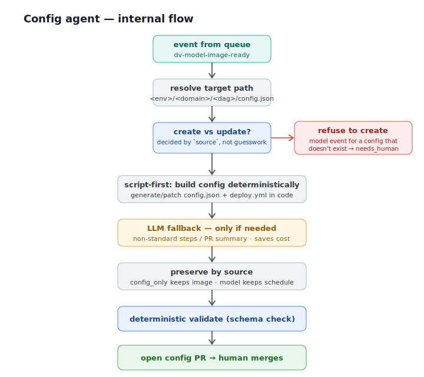

# dv-config-agent

The **config agent** — turns a validated intent payload into a `config.json` /
`deploy.yml` pull request against the platform config repo.

> **This is one of two agents in an event-driven system.** For the full system
> architecture, the problem it solves, and the diagrams, see the main repo:
> **[dbt-factory-agent](https://github.com/hasan-tavakoli/dbt-factory-agent)**.

This agent never talks to the orchestrator directly. The two agents communicate
only through the `dv-model-image-ready` Pub/Sub queue — the orchestrator (or the
dbt repo's CI, once an image is built) publishes an event, and this agent
consumes it asynchronously. Either agent can be redeployed independently; the
queue holds the message until this consumer is ready, retries on transient
failure, and dead-letters anything that keeps failing.



## What it does

1. Consumes an event from the `dv-model-image-ready` Pub/Sub queue.
2. Resolves the target config path: `<env>/<domain>/<dag>/config.json`
   (`scripts/check_config.py::resolve_path`).
3. Decides **create vs. update** based on the explicit `source` field in the
   payload (`config_only` vs. `model`) — never inferred implicitly.
4. Builds the config **deterministically in code first (script-first).** The LLM
   is invoked only when genuinely needed:
   - to classify a free-text `config_intent` as standard vs. non-standard, and
     generate custom dbt steps for the non-standard case, and
   - to draft a plain-English PR summary and risk assessment *after* the config
     is already built and validated.

   This deterministic-first design is both a safety choice (deterministic code
   can't be prompt-injected) and a cost choice — no LLM call is made on the
   common path.
5. Runs a deterministic validator (`scripts/validate_dbt_configs.py`) against
   the generated `config.json` and `deploy.yml`.
6. Opens a pull request on the platform config repo. **A human merges — there
   is no auto-merge.**

## Key safety behaviors

- **Source-aware create vs. update.** A `model` (image-ready) event for a config
  that doesn't exist is **refused**, not fabricated from scratch — it carries no
  schedule or steps, so the agent routes it to a human instead of guessing.
- **Preserves existing values by source.** A `config_only` update keeps the
  existing image; a `model` update keeps the existing schedule. Each source only
  ever touches the fields it is authoritative for.
- **New DAGs require a schedule.** A `create` task without a `schedule` in the
  payload fails validation rather than writing an incomplete config.
- **Production guard.** This system writes non-production config only; anything
  targeting production is routed to a human.
- **Isolated git workflow.** All git operations run in a temporary directory and
  push only to a `feature/*` branch as a PR — never directly to a protected
  branch.
- **No secrets in code.** `GITHUB_TOKEN` and `GEMINI_API_KEY` are read from the
  environment / Secret Manager, never hardcoded.

## Course concepts demonstrated

- **Multi-agent ADK system** — a standalone ADK 2.0 `Workflow` agent, deployed
  independently and coordinated purely through Pub/Sub.
- **Deployability** — deployed to Agent Runtime (Vertex AI Reasoning Engine)
  with `agents-cli`; secrets from Secret Manager.
- **Security** — source-aware guards, production guard, deterministic validation,
  isolated feature-branch-only git flow.
- **Agents CLI** — scaffolded, tested, and deployed end to end with `agents-cli`.

## Setup

Requirements: [`uv`](https://docs.astral.sh/uv/), `agents-cli`, Google Cloud SDK.

```bash
uv sync
```

Required environment variables (set as env vars or Secret Manager entries —
values are never committed):

| Variable | Purpose |
|---|---|
| `GITHUB_TOKEN` | Opens PRs against the platform config repo |
| `GEMINI_API_KEY` | LLM calls for `config_intent` classification / PR summary |
| `GOOGLE_CLOUD_LOCATION` | Set to `global` for Gemini model routing |

## Deploy

```bash
gcloud config set project <your-gcp-project-id>

agents-cli deploy \
  --project <your-gcp-project-id> \
  --region europe-west1 \
  --secrets "GITHUB_TOKEN=GITHUB_TOKEN,GEMINI_API_KEY=GEMINI_API_KEY" \
  --update-env-vars "GOOGLE_CLOUD_LOCATION=global"
```

Deploys to Agent Runtime in `europe-west1` (see `agents-cli-manifest.yaml`). A
push subscription on `dv-model-image-ready` delivers events to the deployed
agent; the topic has a dead-letter topic for reliability.

## Testing

```bash
uv run pytest tests/unit tests/integration
```

## Project structure

```
dv-config-agent/
├── app/
│   ├── agent.py          # Workflow: classify → check/build config → validate → PR
│   └── fast_api_app.py   # FastAPI server (ADK + reasoning-engine routes)
├── scripts/
│   ├── check_config.py         # Deterministic create/update logic, git clone/push
│   ├── dbt_config_models.py    # Pydantic models for config.json
│   └── validate_dbt_configs.py # config.json validator
└── tests/                # Unit and integration tests
```
